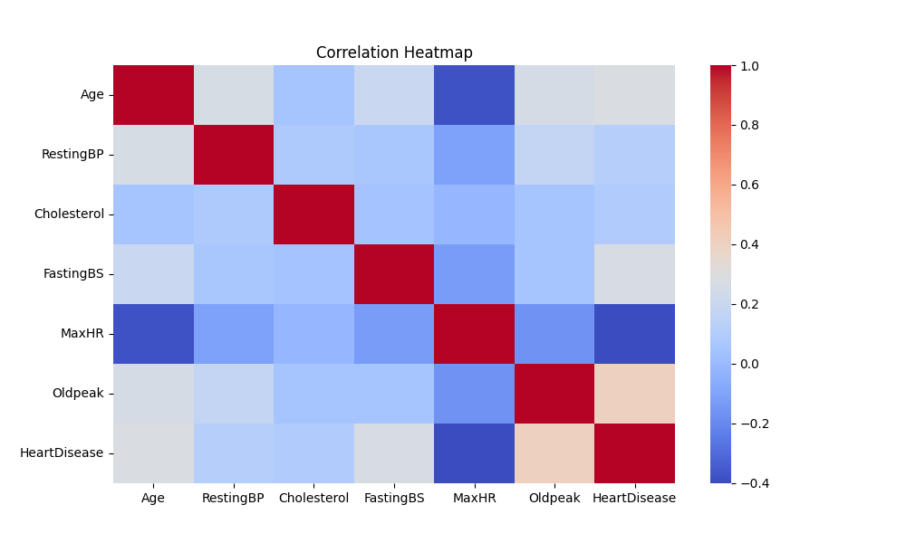
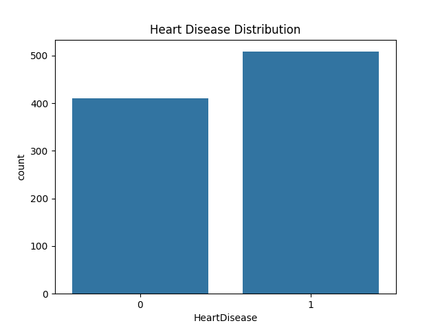
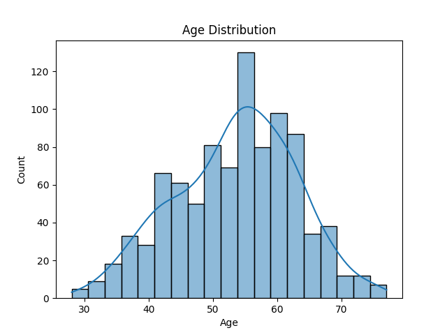
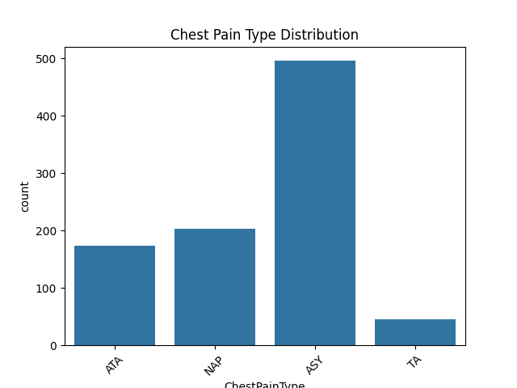
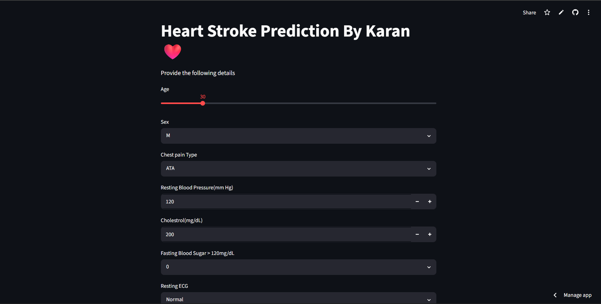
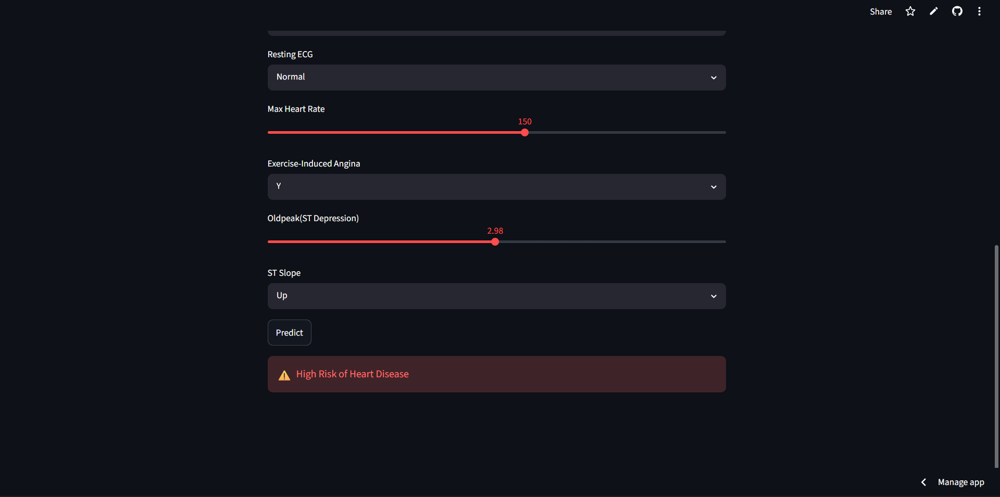

# 🫀 Heart Disease Prediction System

## 📌 Project Overview

The Heart Disease Prediction System is a Machine Learning project that predicts whether a patient is at risk of heart disease based on clinical and health-related attributes. The project combines data analysis, machine learning, and an interactive web application to provide quick and reliable predictions.

The application is built using Python and Streamlit and is deployed online for easy access.

---

## 🎯 Problem Statement

Heart disease remains one of the leading causes of death worldwide. Early identification of high-risk patients can help healthcare professionals make informed decisions and improve patient outcomes.

The goal of this project is to develop a machine learning model capable of predicting the likelihood of heart disease using patient medical data.

---

## 🚀 Live Demo

**Try the application here:**

https://heart-disease-prediction-wg2zfecvfhs5knayj6fuky.streamlit.app/

---

## ✨ Key Features

* Predicts the likelihood of heart disease using Machine Learning
* Interactive Streamlit web application
* User-friendly interface for entering patient information
* Real-time prediction results
* Exploratory Data Analysis (EDA)
* Data visualization using charts and graphs
* Online deployment for easy access

---

## 📊 Exploratory Data Analysis

### Correlation Heatmap



### Heart Disease Distribution



### Age Distribution



### Chest Pain Type Distribution



---

## 🧠 Machine Learning Model

### Model Information

* Problem Type: Binary Classification
* Target Variable: HeartDisease
* Features Used:

  * Age
  * Sex
  * ChestPainType
  * RestingBP
  * Cholesterol
  * FastingBS
  * RestingECG
  * MaxHR
  * ExerciseAngina
  * Oldpeak
  * ST_Slope

The machine learning model analyzes patient health indicators and predicts whether a patient is likely to have heart disease.

---

### Home Page



### Prediction Result



---

## 🧰 Tech Stack

* Python
* Pandas
* NumPy
* Scikit-learn
* Matplotlib
* Seaborn
* Streamlit
* Git
* GitHub

---

## 📁 Project Structure

```text
heart-disease-prediction/
│
├── app.py
├── model/
│   ├── model.pkl
│   └── columns.pkl
│
├── notebooks/
│   ├── heart_disease_analysis.ipynb
│   └── graphs/
│       ├── age_distribution.png
│       ├── chest_pain_distribution.png
│       ├── cholesterol_distribution.png
│       ├── correlation_heatmap.png
│       ├── heart_disease_distribution.png
│       └── restingbp_distribution.png
│
├── images/
│   ├── app.png
│   └── app-result.png
│
├── requirements.txt
└── README.md
```

---

## ⚙️ Installation

Clone the repository:

```bash
git clone https://github.com/karansingh2328/heart-disease-prediction.git
```

Move into the project directory:

```bash
cd heart-disease-prediction
```

Install dependencies:

```bash
pip install -r requirements.txt
```

Run the Streamlit application:

```bash
streamlit run app.py
```

---

## 👨‍💻 Author

**Karan Singh**

GitHub: https://github.com/karansingh2328

---

⭐ If you found this project useful, consider giving it a star.
